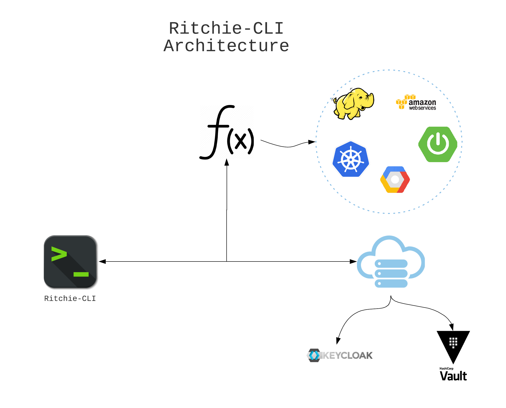

# [ Planilha de Teste ](https://docs.google.com/spreadsheets/d/1fnfxnDMJxnjYJ-OLqZuGPVUhUQvyU9CLBCQl2-sPaTc/edit?usp=sharing)

# Ritchie-CLI

Project created to automate and simplify day-to-day tasks transformed into the simple command line. Ritchie is structured in tree decisions where you can create your own commands and execute when you want, just needing to create your formulas or use them as existing ones. 

<p align="center">
  
</p>

## Prerequisite

Before starting with Ritchie, check the following requirements:

* Owning a `<Windows / Linux / Mac>` machine.
* Check documentation of your ritchie-cli formulas.
* Understand some type of programming language (If creating your own formulas).

## How to install Ritchie-CLI

For install Ritchie-CLI follow the step-by-step:

Installing from the script:

```
curl -fsSL -o install.sh http://ritchie-cli-bucket234376412767550.s3-website-sa-east-1.amazonaws.com/install.sh
chmod +x install.sh
./install.sh linux bash (linux) ou ./install.sh linux zsh(mac)
```
Installing from the [ Binaries ](Release.md)

* Download Ritchie-CLI at the following link: 
[ Binaries ](Release.md)

Linux and macOS:
```
$ chmod +x /path/to/Download/rit
$ sudo mv /path/to/Download/rit /usr/local/bin
$ rit
    A CLI that developers can build and operate
    your applications without help from the infra staff.
    Complete documentation is available at https://github.com/ZupIT/ritchie-cli

    Usage:
    rit [command]

    Available Commands:
    apply       Apply objects from some type
    completion  Add autocomplete for terminal
    create      Create objects
    delete      Delete objects
    generate    Generate objects from some type
    help        Help about any command
    init        Initialize a working directory
    login       User login
    set         Set objects
    version     Print version

    Flags:
    -h, --help   help for rit

    Use "rit [command] --help" for more information about a command.

```

If everything went well, you can now use Ritchie-CLI in your command prompt.

Windows:
```
<install_command>
```
## How to use Ritchie-CLI

For use the Ritchie-CLI follow the step-by-step:

1. Log in to the Ritchie-CLI to identify the user:

```
$rit login
    Login [Organization]:  zup
    Login [Username]:  user
    Login [Password]:  ********
    2020/01/10 13:52:41 Login successful!
```

3. Enabling Ritchie-CLI auto-complete:

```
$ source <(rit completion bash)
```
4. Setting your Ritchie-CLI credentials:

```
$ rit set credential 
    Use the arrow keys to navigate: ↓ ↑ → ← 
    Credential [Type]: 
    ▸ me

    ✔ me
    Use the arrow keys to navigate: ↓ ↑ → ← 
    Credential [Provider]: 
    ▸ github
        gitlab
        aws
        darwin
        jenkins

    ✔ me
    ✔ github
    Credential [username]:  username
    Credential [token]: token

```

5. Downloading the formulas created in the repository:

```
$ rit init
    2020/01/10 13:53:52 Loading user session...
    2020/01/10 13:53:52 done.
    2020/01/10 13:53:52 Loading and saving command tree...
    2020/01/10 13:53:52 done.
    2020/01/10 13:53:52 Getting formulas...
    2020/01/10 13:53:52 Pull formulas...
    2020/01/10 13:53:53 done.
```

6. Using an existing formula (coffee):

```
$ rit generate scaffold coffee 
    2020/01/10 14:09:26 Running cmd coffee with args []
    Type your name:  Username
    ✔ cappuccino
    ✔ true
    2020/01/10 14:09:35 Preparing your coffee Username .....
    2020/01/10 14:09:36 ......
    2020/01/10 14:09:37 ......
    2020/01/10 14:09:38 ......
    2020/01/10 14:09:39 Your cappuccino coffee is ready, enjoy your trip
```
6. How to request help with Ritchie-CLI commands:

```
$ rit generate -h
    Generate objects from some type

    Usage:
    rit generate [flags]
    rit generate [command]

    Available Commands:
    github      Apply GitHub objects
    jenkins     Apply Jenkins objects
    scaffold    Generates a scaffold by some template

    Flags:
    -h, --help   help for generate

    Use "rit generate [command] --help" for more information about a command.
$ rit generate scaffold -h
    Generates a scaffold by some template

    Usage:
    rit generate scaffold [flags]
    rit generate scaffold [command]

    Available Commands:
    coffee      Generates a project by coffee template
    spring-iti  Generates a project for kotlin/java

    Flags:
    -h, --help   help for scaffold

    Use "rit generate scaffold [command] --help" for more information about a command.
    
$ rit generate scaffold coffee 
    2020/01/10 14:09:26 Running cmd coffee with args []
    Type your name:  Username
    ✔ cappuccino
    ✔ true
    2020/01/10 14:09:35 Preparing your coffee Username .....
    2020/01/10 14:09:36 ......
    2020/01/10 14:09:37 ......
    2020/01/10 14:09:38 ......
    2020/01/10 14:09:39 Your cappuccino coffee is ready, enjoy your trip
```

## How to contribute your formulas to Ritchie-CLI

To contribute to the Ritchie-CLI (Formulas), follow steps-by-step:

1. Fork the repository.[Ritchie-CLI](https://github.com/ZupIT/ritchie-cli)
2. Create a branch: `git checkout -b <branch_name>`.
3. Learn [how to create formulas for Ritchie-CLI](https://github.com/ZupIT/ritchie-formulas/blob/master/README.md)
4. Create your formulas and commit: `git commit -m '<commit_message>'`
5. Push your branch: `git push origin <project_name>/<location>`
6. Make pull request.

## Contributors

* [@sandokandias](https://github.com/sandokandias) 
* [@marcosgmgm](https://github.com/marcosgmgm) 
* [@viniciusramosdefaria](https://github.com/viniciusramosdefaria) 
* [@kaduartur](https://github.com/kaduartur) 
* [@maykonmendeszup](https://github.com/maykonmendeszup) 
* [@erneliojuniorzup](https://github.com/erneliojuniorzup)
