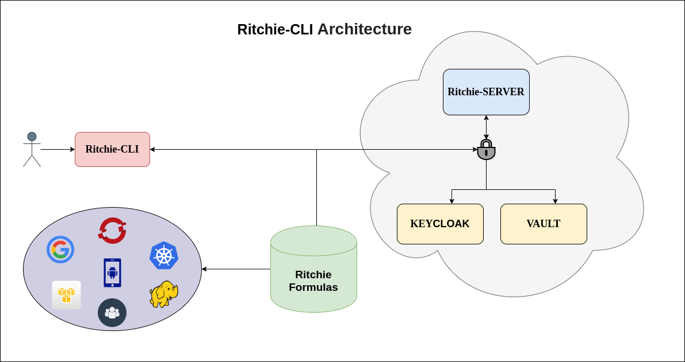

# [ Planilha de Teste ](https://docs.google.com/spreadsheets/d/1fnfxnDMJxnjYJ-OLqZuGPVUhUQvyU9CLBCQl2-sPaTc/edit?usp=sharing)

# Ritchie-CLI

Projeto criado para automatizar e simplicar suas tarefas do dia-a-dia transformando-as em linha de comando simples. O Ritchie é estruturado em decisões de arvore onde você pode criar seus próprios comandos e executar quando quiser, precisando somente criar suas formulas ou já usar as existentes. 

Segue abaixo a sua arquitetura macro do Ritchie-CLI:  


<p align="center">
  
</p>

## Pre-Requisitos

Antes de começar com o Ritchie verifique aos seguintes requisitos:

* Possuir uma máquina `<Windows/Linux/Mac>`.
* Verificar documentação das formulas do seu ritchie-cli.
* Compreender algum tipo de linguagem de programação (Caso for criar suas próprias fórmulas).

## Instalando Ritchie-CLI

Para instalar o Ritchie-CLI siga os seguintes passos:

Instalando pelo script:

```
curl -fsSL -o install.sh http://ritchie-cli-bucket234376412767550.s3-website-sa-east-1.amazonaws.com/install.sh
chmod +x install.sh
./install.sh linux bash
```
Instalando pelo [ Binaries ](Release.md)

* Realizar download do Ritchie-CLI no seguinte link: 
[ Binaries ](Release.md)

Linux e macOS:
```
$ chmod +x /path/to/Download/plz
$ sudo mv /path/to/Download/plz /usr/local/bin
$ plz
    A CLI that developers can build and operate
    your applications without help from the infra staff.
    Complete documentation is available at https://github.com/ZupIT/ritchie-cli

    Usage:
    plz [command]

    Available Commands:
    apply       Apply objects from some type
    completion  Add autocomplete for terminal
    create      Create objects
    generate    Generate objects from some type
    help        Help about any command
    init        Initialize a working directory
    login       User login
    set         Set objects
    version     Print version

    Flags:
    -h, --help   help for plz

    Use "plz [command] --help" for more information about a command.

```

Se tudo ocorreu bem, você já consegue utilizar o Ritchie-CLI no seu prompt de comandos.

Windows:
```
<install_command>
```
## Usando Ritchie-CLI

Para usar o Ritchie-CLI siga os seguintes passos:

1. Realizar login para o Ritchie-CLI identificar o usuario:

```
$plz login
    Login [Organization]:  zup
    Login [Username]:  ernelio
    Login [Password]:  ********
    2020/01/10 13:52:41 Login successful!
```

3. Habilitando auto-complete do Ritchie-CLI: 

```
$ source <(plz completion bash)
```
4. Setando suas credenciais no Ritchie-CLI:

```
$ plz set credential 
    Use the arrow keys to navigate: ↓ ↑ → ← 
    Credential [Type]: 
    ▸ me

    ✔ me
    Use the arrow keys to navigate: ↓ ↑ → ← 
    Credential [Provider]: 
    ▸ github
        gitlab
        aws
        darwin
        jenkins

    ✔ me
    ✔ github
    Credential [username]:  username
    Credential [token]: token

```

5. Realizando download das formulas criadas no repositorio:

```
$ plz init
    2020/01/10 13:53:52 Loading user session...
    2020/01/10 13:53:52 done.
    2020/01/10 13:53:52 Loading and saving command tree...
    2020/01/10 13:53:52 done.
    2020/01/10 13:53:52 Getting formulas...
    2020/01/10 13:53:52 Pull formulas...
    2020/01/10 13:53:53 done.
```

6. Utilizando uma formula existente (coffee)

```
$ plz generate scaffold coffee 
    2020/01/10 14:09:26 Running cmd coffee with args []
    Type your name:  Username
    ✔ cappuccino
    ✔ true
    2020/01/10 14:09:35 Preparing your coffee Username .....
    2020/01/10 14:09:36 ......
    2020/01/10 14:09:37 ......
    2020/01/10 14:09:38 ......
    2020/01/10 14:09:39 Your cappuccino coffee is ready, enjoy your trip
```
6. Pedindo ajuda com os comandos do plz

```
$ plz generate -h
    Generate objects from some type

    Usage:
    plz generate [flags]
    plz generate [command]

    Available Commands:
    github      Apply GitHub objects
    jenkins     Apply Jenkins objects
    scaffold    Generates a scaffold by some template

    Flags:
    -h, --help   help for generate

    Use "plz generate [command] --help" for more information about a command.
$ plz generate scaffold -h
    Generates a scaffold by some template

    Usage:
    plz generate scaffold [flags]
    plz generate scaffold [command]

    Available Commands:
    coffee      Generates a project by coffee template
    spring-iti  Generates a project for kotlin/java

    Flags:
    -h, --help   help for scaffold

    Use "plz generate scaffold [command] --help" for more information about a command.
    
$ plz generate scaffold coffee 
    2020/01/10 14:09:26 Running cmd coffee with args []
    Type your name:  Username
    ✔ cappuccino
    ✔ true
    2020/01/10 14:09:35 Preparing your coffee Username .....
    2020/01/10 14:09:36 ......
    2020/01/10 14:09:37 ......
    2020/01/10 14:09:38 ......
    2020/01/10 14:09:39 Your cappuccino coffee is ready, enjoy your trip
```

## Contribuindo com suas formulas para o Ritchie-CLI

Para contribuir com o Ritchie-CLI (Formulas), siga os seguintes passos:

1. Fork deste repositorio.[ Repositorio ritchie-cli](https://github.com/ZupIT/ritchie-cli)
2. Criar uma branch: `git checkout -b <branch_name>`.
3. Aprender como criar formulas para o Ritchie [Como Criar Formulas (Ritchie-CLI)](https://github.com/ZupIT/ritchie-formulas/blob/master/README.md)
4. Crie sua(s) formula(s) e realize o commit da(s) mesma(s): `git commit -m '<commit_message>'`
5. Realize o Push para sua branch: `git push origin <project_name>/<location>`
6. Realizar pull request.


## Contribuidores

* [@sandokandias](https://github.com/sandokandias) 
* [@marcosgmgm](https://github.com/marcosgmgm) 
* [@viniciusramosdefaria](https://github.com/viniciusramosdefaria) 
* [@kaduartur](https://github.com/kaduartur) 
* [@maykonmendeszup](https://github.com/maykonmendeszup) 
* [@erneliojuniorzup](https://github.com/erneliojuniorzup)
